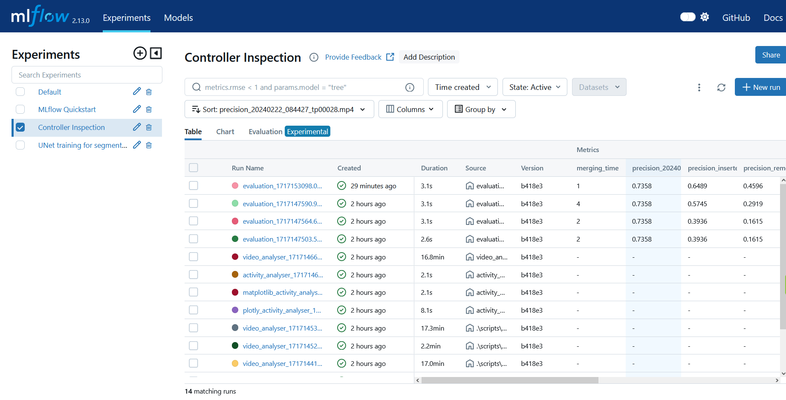
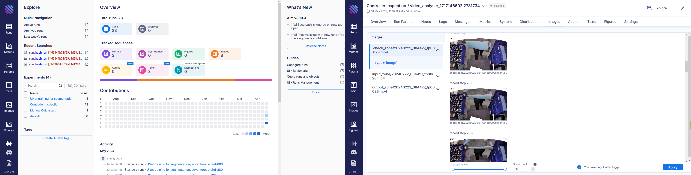

# Experiment management with MLFlow (and AimFlow)

In Cognexa we are working on a lot of machine learning projects. We have a lot of experiments to run and a lot of results to track. After an analysis of existing tools, we decided to use [MLflow](https://mlflow.org/) for experiment management and tracking.



AIMFlow is self-hosted alternative to MLFlow. It also provides a integration to MLFlow, so some of its features can enhance the visuals of MLFlow UI.



## What is this Repository?

This repository contains Dockerfile and docker-compose.yml for running MLflow server with PostgreSQL as a backend. It also contains a simple example of how to use MLflow in Python.

## Where does it run?

This code is run locally on our servers, so developers does not have to setup anything locally. They only need to track their experiments using MLflow API to our server.

We can connect via IP: `http://192.168.30.21:8080` or on alias: `http://mlflow.cognexa.com`.

**Centralization:** This also allows us to have all the experiments and tracked projects in one place.

### Quickguide how to start a project and a run

- IP and port where MLFlow runs: `http://192.168.30.21:8080`
- IP and port where AIMFlow runs: `http://192.168.30.21:43800`

``` python
import mlflow

mlflow.set_tracking_uri(uri="http://192.168.30.21:8080")
mlflow.set_experiment("Project Name")
mlflow.start_run(run_name="Name of the run")

# ... do your magic

mlflow.end_run()
```


``` python
#!/usr/bin/env python3
# -*- coding: utf-8 -*-


```

As MLFlow API is quite simple, there is a short introduction with information in a `quickstart` [jupyter notebook](./example.ipynb). The notebook also contains links for logging tensorflow and pytorch models. Quick Introduction to MLFlow API contains information about:

- how to track keras/torch models and metrics
- how to store artefacts
- how to log parameters
- how to work with runs
- how to load existing artefacts and models for further use

## Experiment Management Guidelines

Additionally, this repository contains [guidelines](./GUIDELINES.md) of how to manage experiments in MLFlow, and what suggested to track while working on ML+CV projects. It is important to have a consistent way of tracking experiments, so that we can easily compare them and reproduce them.
